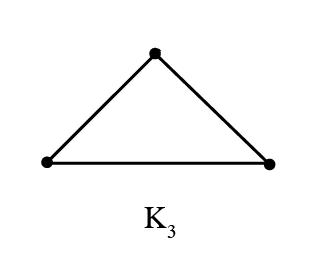

# Graph Theory Fundamentals

## Graph
Notation: G = (V, E)

Where G is the graph, V represents the set of vertices and E represents the set of edges.

## Simple Graph
A simple graph has no loops or multiple edges.

{width=250px}
{width=250px}

## Neighborhood
A set of all vertices adjacent to a vertex.

Using the simple graph above:

N(b) = {a, d, c}

N(a) = {b}

\newpage

## Degree
Cardinality (count) of a neighborhood.

Using the simple graph shown earlier:

deg(b) = |N(b)| = 3

deg(a) = 1

## Handshaking Theorem
The sum of the degrees of a graph is equal to twice the the number of edges.

Using the simple graph shown earlier:

$$
2 |E| = \sum_{v \in V} deg(v)
$$
$$
2 \times 3 = deg(a) +  deg(b) + deg(c) + deg(d)
$$
$$
2 \times 3 = 1 + 3 + 1 + 1
$$

\newpage

## Complete Graph
Contains exactly one edge between every pair of different vertices.

Notation: $K_n$ where n is the number of vertices.

{width=250px}
{width=250px}
{width=250px}
{width=250px}

\newpage

## Cycles

Every vertex must have a degree of two, and the graph must be closed.

Spread vertices out to a circle for best image as done below.

{width=250px}
{width=250px}
{width=250px}

\newpage

## Wheels

Like a cycle, but with a central vertex that connects to all other vertices.

{width=250px}
{width=250px}
{width=250px}

\newpage

## Bipartite Graph

For sets of vertices $v_1$ and $v_2$, every edge connects a vertex in $v_1$ to $v_2$.

The following graph is bipartite:

{width=250px}

It can be partitioned into the following sets:

$v_1$ = {a, c}

$v_2$ = {b, d}

Note: triangles and wheels are _not_ bipartite.

\newpage

## Coloring/Color Theory

_Coloring_ can be used to determine if a graph is bipartite. A graph's vertices can be colored with two alternating colors if it is bipartite:

{width=250px}

The following graph can _not_ be colored using two alternating colors:

{width=250px}

\newpage

## Adjacency Matrix

A square n x n matrix for n vertices that counts number of edges in between vertices. It will always be symmetrical.

{width=250px}

The adjacency matrix for the graph above:

{width=150px}
